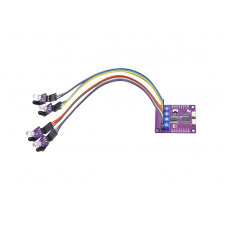

# Zio Line Finder (Qwiic 4 Transceivers)

> This product can be available for purchase [here](https://www.smart-prototyping.com/Zio-Line-Finder-Qwiic-4-Transceivers).

#### Description
This is a Qwiic I2C version of a line-following sensor array, intended especially for building robots that take advantage of I2C for communication between subsystems.

Like other line-following sensor modules, it has four IR reflectance-sensing sub-modules that can detect a line’s position. We use a PCA9539A I/O expander to detect when a given sub-module’s output voltage crosses its logic-level threshold, indicating the detection of the line. If one of the sub-module I/O channels is driven LOW, that’s where the line is.

There are four potentiometers to independently adjust the IR modules’ sensitivities to suit different robot platforms, accounting for differences in sensor mounting heights. There are four LEDs that provide a visual indicator for the detection status of each channel, which makes it easy to tune the sensitivity of each sensor channel.
Because the PCA9539A has 16 digital I/O channels, we’ve broken out the other 12 channels to standard-pitch pin-headers so you can take advantage of them as you see fit.

#### Specification

* Four Channel IR Sensors
* I2C sensor: PCA9539A
* I2C address:0x74-0x77 (Default:0x74)
* Differential Comparator IC: LM339DR
* Extra Digital Sensor Channel: 12 Channels
* Dimension: 47.2x 36.5mm
* Weight: Main board: 7.4g, IR sensor board: 0.9g

#### Links

* [Eagle File and Schematic](https://github.com/ZIOCC/Zio-Line-Finder-Qwiic-4-Transceivers-/blob/master/Line%20Finder%20Main%20Board%20SCH-PDF.pdf)
* [PCA9539 Library and Example Code](https://www.smart-prototyping.com/image/data/NOA-RnD/101904%20line%20finder/Zio_Line_Finder_Library.zip)
* [PCA9539 Datasheet](http://www.ti.com/lit/ds/symlink/pca9539.pdf)
* [LM339DR Datasheet](http://www.ti.com/lit/ds/snosbj3e/snosbj3e.pdf)

> ###### About Zio
> Zio is a new line of open sourced, compact, and grid layout boards, fully integrated for Arduino and Qwiic ecosystem. Designed ideally for wearables, robotics, small-space limitations or other on the go projects. Check out other awesome Zio products [here](https://www.smart-prototyping.com/Zio).
